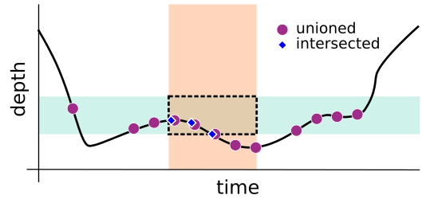

# deep-framex

Frame extraction library for deep sea video. Frames are self-describing and metadata is embedded directly into image files so context travels with the frame into any downstream system.

## Installation

**uv:**
```
uv pip install git+https://github.com/subseadata/deep-framex
```

**pip:**
```
git clone <repo>
cd deep-framex
pip install -e .
```

## Demo

Worked examples live in `notebooks/marimo/`, a hands-on workshop that runs deep-framex end to end. It ships with its own sample video (`clip.mp4`) and sensor logs (`sensor.csv`, the CTD records `ex2503_rovctd.csv` / `ex2503_rovctd_badclock.csv`, the nav record `ex2503_dive01_nav.csv`, and the hand-joined CTD+nav record `ex2503_dive01_sensors.csv`). Work through them in order:

| Notebook | What it covers |
|---|---|
| `00-getting-started.py` | Confirm your environment and dependencies are ready |
| `01-simple-extraction.py` | Write a minimal YAML spec and extract frames from the sample clip |
| `02-examine-frames.py` | Inspect the output — image previews, EXIF, iFDO, and BIIGLE metadata |
| `03-advanced-extraction.py` | Restrict extraction to UTC time windows with varied intervals |
| `04-sensor-extraction.py` | Add sensor data and extract by environmental constraints (e.g. depth) |
| `05-spec-review.py` | Recap of the spec format and what extraction takes in and puts out |
| `06-video-start.py` | Supply start times for videos that have no `creation_time` metadata |
| `07-sensor-time.py` | Correct a sensor clock that disagrees with the video clock, and check it with `--plan` |
| `08-playground.py` | Sandbox — edit the spec, re-plan, watch the plots and the extracted frames change |

Launch one from inside the notebook directory as:

```
uv run marimo edit notebooks/marimo/00-getting-started.py
```

The notebooks read `clip.mp4`, `sensor.csv` and write `frames/` using paths relative to the working directory, so run them from `notebooks/marimo/` — `uv` still finds the project by walking up to the repo root. `uv run` builds the project environment (marimo and the plotting libraries are included as dependencies), so no separate install step is needed.

`06-video-start.py`, `07-sensor-time.py` and `08-playground.py` download the same three larger clips (~75 MB each) into `EX-clips/` on demand via a button in the notebook; the rest run entirely on the bundled sample files.

## Command-line use

```
deep-framex <source> --spec <yaml> [--data <csv>] [--output <dir>]
```

| Argument | Description |
|---|---|
| `source` | Directory of video files, or one or more explicit video paths |
| `--spec` | Path to a YAML extraction spec (required) |
| `--data` | Path to a single sensor CSV (optional; for several files use a `sensors` block in the spec) |
| `--output` | Output directory for extracted frames (default: `./frames`) |


## Extraction spec

The spec is a YAML file that defines extraction rules and optional sensor mappings, project metadata, and output settings. A fully annotated template is in `extraction_spec.yaml` at the repository root.

Minimal spec — one frame every 10 seconds for the entire session:

```yaml
rules:
  - interval_s: 10.0
```

Rules can be restricted to UTC time windows (`periods`), sensor value ranges (`constraints`), or both. Periods and constraints on the **same rule intersect**; separate rules are **unioned**.

```yaml
rules:
  # coarse baseline
  - interval_s: 30.0

  # denser during a specific UTC window
  - interval_s: 2.0
    periods:
      - start: "2025-11-15T10:25:00Z"
        end:   "2025-11-15T10:30:00Z"

  # dense while depth is between 1000 and 1200 m
  - interval_s: 5.0
    constraints:
      - column: depth
        min: 1000
        max: 1200

  # intersecting rules
  - interval_s: 2.0
    periods:
      - start: "2025-11-15T10:25:00Z"
        end:   "2025-11-15T10:30:00Z"
    constraints:
      - column: depth
        min: 1000
        max: 1200
```



Conceptual diagram showing the difference between unioned (purple circles) and intersected (blue diamonds) extraction rules, across a depth constraint (teal) and a time period (orange). Intersected single rules will only extract within the overlapping area (dashed box). Unioned rules will extract anywhere a rule condition is met.


**All timestamps in the spec itself — `periods`, `video_start_times`, `sensor_start_time` — must be ISO 8601 with an explicit UTC offset (`Z` or `+00:00`).** Timestamps inside your sensor CSV are more forgiving; see **Timestamp formats** below.

### Sensor mappings

The `mappings` block tells the tool which CSV columns to load and what to call them. Required whenever a sensor CSV is provided.

```yaml
mappings:
  timestamp:   Timestamp        # required — your CSV column for UTC time
  latitude:    Latitude_ddeg
  longitude:   Longitude_ddeg
  depth:       Depth_m
  temperature: Temp_degC        # any other columns you want
```

The left-hand name is what the tool uses everywhere in constraint rules, filename templates, and image metadata. The right-hand value is the exact column header from your CSV.

These left-side names trigger automatic routing to specific metadata fields:

| Name | Destination |
|---|---|
| `latitude` | EXIF GPSLatitude + iFDO image-latitude (decimal degrees; negative = south) |
| `longitude` | EXIF GPSLongitude + iFDO image-longitude (decimal degrees; negative = west; 0–360 also accepted) |
| `depth` | EXIF GPSAltitude (below sea level) + iFDO image-depth |
| `altitude` | iFDO image-altitude-meters |
| `heading` | iFDO image-heading |
| `pitch` | iFDO image-pitch |
| `roll` | iFDO image-roll |


Any other name is written to XMP only. Only the columns you list are loaded, everything else in the CSV is ignored.

### Several sensor files

When the readings are spread across more than one file, list each one in a `sensors` block instead of using `mappings` + `--data`. Each entry names its own file, its own timestamp column, and its own mappings:

```yaml
sensors:
  - file: ctd.csv
    timestamp: utc_time
    depth: Depth_m
    temperature: Temp_degC
  - file: nav.csv
    timestamp: [Date, Time]
    timestamp_format: "%d/%m/%Y %H:%M:%S"
    latitude: Lat_ddeg
    longitude: Lon_ddeg
```

Each file is read on its own timestamps and interpolated separately, then the results are merged into one set of values per frame. The files need not share a sample rate or a start time, and there is no need to join them yourself.

The left-side names all land in one shared namespace, so **two entries may not map the same name** — that would silently overwrite one file's values with the other's. Rename one side (`ctd_depth` and `nav_depth`). The spec is rejected at parse time, naming both files and the clashing key.

Each entry can also carry:

| Key | Meaning |
|---|---|
| `time_shift` | Signed `"HH:MM:SS"` added to this file's timestamps — the per-file `sensor_time_shift` |
| `start_time` | ISO 8601 UTC time to place this file's earliest reading at — the per-file `sensor_start_time` |
| `interpolation_window` | Rows per side for this file; omit to use the spec-level value |

`time_shift` and `start_time` are mutually exclusive per entry, as at spec level. `interpolation_window` is per file because window size only means something relative to a file's sample rate: 2 rows span about 2 s on a 1 Hz CTD but 20 s on a nav fix arriving every 10 s.

A single `mappings` block plus `--data` is the one-file shorthand for a one-entry `sensors` list. Both forms are supported; use whichever fits.

### Timestamp formats

Your timestamp column is read as ISO 8601 by default — `2025-11-15T10:25:00Z`, a space in place of the `T`, and any number of fractional-second digits all work, with or without an offset. Dot-separated dates (`15.11.2025 10:25:00`) are recognised too.

Anything else needs `timestamp_format`, a strptime format for the whole value:

```yaml
mappings:
  timestamp:        "Date / Time"
  timestamp_format: "%d/%m/%Y %H:%M"
  depth:            PRESSURE_m
```

**Slash-separated dates always need `timestamp_format`.** `01/09/2022` is 1 September in some loggers and 9 January in others, and nothing inside the file says which. The tool will not guess, because a wrong guess is silent — you get frames tagged eight months off with no error.

If your date and time sit in separate columns, list them. The cells are joined with a single space and parsed as one value:

```yaml
mappings:
  timestamp:        [Date, Time]
  timestamp_format: "%d/%m/%Y %H:%M:%S"
```

With a `sensors` block each entry names its own `timestamp` and `timestamp_format`, so files written by different loggers in different date layouts can be mixed in one run.

Timestamps with no timezone marker are assumed to be UTC, and the tool warns once per run when that happens. If they are not UTC, correct them with `sensor_time_shift` or `sensor_start_time` — see **Aligning sensor time to video time** below.

### Other spec options

| Key | Default | Description |
|---|---|---|
| `metadata` | — | Arbitrary key/value pairs embedded in every frame (EXIF, IPTC, XMP, iFDO) |
| `filename_template` | `{utc}_{video_stem}.jpg` | Output filename pattern — variables: `{utc}`, `{video_stem}`, `{offset_s}`, any mapping key, any metadata key |
| `initial_offset_s` | `0.0` | Shift the sampling grid this many seconds from session start |
| `interpolation_window` | `2` | Sensor rows to use on each side when interpolating values; each `sensors` entry may override it |
| `stream_output` | `false` | Write each frame immediately instead of buffering per video |
| `max_workers` | `1` | Worker processes for extraction; `>1` extracts multiple videos in parallel |
| `xmp_namespace_uri` | `https://deep-framex.org/xmp/v1/` | URI for the custom XMP namespace |
| `xmp_namespace_prefix` | `dfx` | Prefix for the custom XMP namespace |
| `video_start_times` | — | Map of video filename → ISO 8601 UTC start time, for footage whose `creation_time` tag is missing or wrong |
| `sensor_time_shift` | — | Signed `"HH:MM:SS"` added to every sensor timestamp, for a sensor clock that ran ahead or behind |
| `sensor_start_time` | — | ISO 8601 UTC time to place the earliest sensor reading at; all readings shift by the same amount |
| `sensors` | — | One entry per sensor CSV, each with its own file, timestamp column, mappings, clock correction, and interpolation window — see **Several sensor files** |


**Highly Reccommended:** always include `{utc}` in your filename template. The planner guarantees unique timestamps, so `{utc}` guarantees unique filenames. Templates that omit it may silently overwrite frames.

When using `max_workers > 1`, set `stream_output: true`. Without it, each worker buffers a full video's decoded frames in memory before writing (≈1.4 GB per worker at 4K/10 s).

### Manually setting video start times

Each video's UTC start time is normally read from its container `creation_time` tag. For footage that is not properly clocked — the tag is missing, or present but wrong — set the start time yourself. Keys are video filenames (basename only); values are ISO 8601 UTC timestamps.

```yaml
video_start_times:
  "dive_001.mp4": "2025-11-15T10:00:00Z"
  "dive_002.mp4": "2025-11-15T10:10:00Z"
```

A listed file is clocked from this block instead of its tag; unlisted files are probed as usual.

### Aligning sensor time to video time

If the sensor logger's clock disagreed with the video clock, every frame gets sensor values read from the wrong moment. Correct it with one of two keys — whichever matches what you know:

```yaml
# The sensor clock ran 90 minutes ahead. Wind it back.
sensor_time_shift: "-01:30:00"
```

```yaml
# You know when the first sensor reading was actually taken.
sensor_start_time: "2025-11-15T10:00:00Z"
```

`sensor_time_shift` adds a signed `HH:MM:SS` duration to every sensor timestamp. **Quote the value.** Unquoted, YAML reads a non-zero-padded duration like `1:30:00` as the sexagesimal integer 5400; deep-framex rejects that rather than guessing what you meant, but it costs you a run.

`sensor_start_time` places the *earliest* sensor reading at the time you give and shifts every other reading by the same amount. It anchors on the earliest reading, not on the first row of the CSV, so the file does not need to be sorted.

The two are alternative ways to say the same thing; setting both is an error. Both preserve the spacing between readings and neither corrects clock drift.

Both keys apply to the whole run, which is what you want with a single sensor file. With a `sensors` block each logger had its own clock, so put the correction on the entry as `time_shift` or `start_time` — see **Several sensor files** above.

Use `--plan` to check an alignment before extracting anything. It prints the interpolated sensor values for every planned frame without decoding a single one:

```
deep-framex video/ --spec spec.yaml --data sensors.csv --plan
```

With a `sensors` block the paths are already in the spec, so `--data` is omitted and each frame's printed values are the merged snapshot from every source.

## Converting raw sensor logs

`src/deep_framex/utils/` holds standalone converters that turn common raw
instrument files into a CSV the importer accepts. Each takes an input and an
output path:

```
uv run python src/deep_framex/utils/cnv_to_csv.py cast.cnv sensors.csv
uv run python src/deep_framex/utils/gpgga_to_csv.py nav.RAW nav.csv
```

`cnv_to_csv.py` reads a Sea-Bird `.cnv` CTD cast; `gpgga_to_csv.py` reads a
logger's `$GPGGA` NMEA log and converts the ddmm.mmmm positions to signed
decimal degrees.

Reach for a converter when the file is not tabular — no header row, a header
buried in a comment block, or a time base that is not a calendar timestamp (a
Sea-Bird `.cnv` counts seconds from 2000-01-01, not the Unix epoch). A
comma-delimited file with a header row imports directly whatever its date
layout, so long as you name the format — see **Timestamp formats** above.

A run can take any number of CSVs, so positions and CTD readings in separate
files each get their own entry in a `sensors` block — no joining needed. See
**Several sensor files** above, and `08-playground.py`, which reads
`ex2503_rovctd.csv` and `ex2503_dive01_nav.csv` that way.

Within a single file, every mapped column must be populated on every row.
Blank cells are rejected, not treated as missing. If two instruments write to
one file at different rates, either split them into two files or fill the
gaps.

## Output

Each extraction run produces:

| File | Description |
|---|---|
| `*.jpg` | Extracted frames with EXIF, IPTC, and XMP metadata embedded |
| `ifdo.json` | iFDO dataset manifest — one entry per frame |
| `biigle_metadata.csv` | Metadata CSV ready to upload to BIIGLE |


## Library API Examples

Each pipeline stage is a standalone function. Import what you need:

```python
from deep_framex import (
    extract,
    spec_from_file, spec_from_dict,
    discover_videos, create_video_session,
    create_session_db, close_session_db, import_csv,
    plan, decode_frames,
    write_frame, write_ifdo_manifest, write_biigle_manifest,
    assemble_biigle_records, parse_filename_template, parse_file_list_csv,
)
```

**Full run from a YAML spec:**

```python
from deep_framex import extract

extract(
    spec_path=Path("spec.yaml"),
    video_source=Path("video/"),
    output_dir=Path("frames/"),
    csv_path=Path("sensors.csv"),   # omit if no sensor data, or if the spec has a sensors block
)
```

**Planning without extraction** — inspect what would be extracted:

```python
spec    = spec_from_file("spec.yaml")
session = create_video_session(discover_videos(Path("video/"), spec.video_start_times))
conn    = create_session_db()

# One table per sensor file; plan() derives the same names from spec.sensors.
for i, source in enumerate(spec.sensors):
    import_csv(source.file, conn, source, source.time_shift, source.start_time,
               f"sensor_readings_{i}")

plans   = plan(spec, session, conn)
close_session_db(conn)

for p in plans:
    print(p.video_file.path.name, len(p.frames), "frames")
```

**Extraction without writing** — raw frames as NumPy arrays:

```python
for frame in decode_frames(video_plan):
    # frame.frame is (H, W, 3) uint8 RGB
    # frame.metadata holds utc_timestamp, sensor values, project metadata
    process(frame.frame)
```

### Distributed / cloud workers - NEEDS TESTING

`plan()` produces self-contained `VideoExtractionPlan` objects that can be serialised to JSON and dispatched to remote workers. Each worker only needs its own video file — not the sensor CSV, the session database, or any other video.

```python
plans = plan(spec, session, conn)
close_session_db(conn)

for p in plans:
    payload = p.model_dump_json()   # self-contained JSON, ~2 KB
    my_queue.send(payload)          # Airflow task, K8s Job, SQS message, etc.

# Each worker:
# plan = VideoExtractionPlan.model_validate_json(payload)
# result = _extract_and_write_video(plan, output_dir, ...)

# Coordinator — gather and write manifests:
all_results = my_queue.collect_all()
write_ifdo_manifest([item for r in all_results for item in r], output_dir)
write_biigle_manifest([item for r in all_results for item in r], output_dir)
```

### Generating BIIGLE metadata from existing images

To build a BIIGLE-compatible CSV from a set of already-extracted images without re-running the full pipeline:

```python
from deep_framex import (
    parse_filename_template, assemble_biigle_records,
    write_biigle_manifest, ColumnMappings,
)

# Parse timestamps from filenames produced by this tool
files = [
    (p.name, parse_filename_template(p, "{dive_id}_{utc}"))
    for p in sorted(Path("frames/").glob("*.jpg"))
]

# Or read a CSV mapping filenames to timestamps
# files = parse_file_list_csv(Path("file_list.csv"))

records = assemble_biigle_records(
    files=files,
    csv_path=Path("sensors.csv"),
    mappings=ColumnMappings(timestamp="Timestamp", depth="Depth_m",
                            latitude="Lat_ddeg", longitude="Lon_ddeg"),
    project_metadata={"cruise_id": "FK250101", "dive_id": "S0042"},
)

write_biigle_manifest(records, Path("output/"))
```

## Structure

```
src/deep_framex/
├── models/          # data models and metadata field routing registry
├── config/          # YAML spec parsing and video file discovery
├── data/            # CSV import
├── db/              # in-memory SQLite session database — used during planning only
├── planning/        # translate rules, time periods, and sensor constraints into frame offsets
├── extraction/      # open video containers and decode frames
├── metadata/        # embed metadata into image files (EXIF, IPTC, XMP), iFDO and BIIGLE manifests
├── output/          # write frames to disk
└── utils/           # coordinate conversion, timestamp parsing, raw-log converters
```

### Pipeline stages

| Stage | Module | Description |
|---|---|---|
| Spec parser | `config/spec_parser.py` | Reads YAML into `ExtractionSpec`; validates all rules, periods, constraints, and datetime strings |
| Video discovery | `config/video_discovery.py` | Resolves a directory or file list into probed `VideoFile` objects with UTC start time and duration |
| Session database | `db/session_db.py` | In-memory SQLite used only during planning; holds sensor readings and the frame plan; discarded after `plan()` returns |
| Data importer | `data/importer.py` | Loads the sensor CSV into the session database; only mapped columns are imported |
| Planner | `planning/planner.py` | Processes rules against the database — intersects periods and constraints, samples at `interval_s`, unions across rules, interpolates sensor values — produces self-contained `VideoExtractionPlan` objects |
| Extractor | `extraction/frame_extractor.py` | Generator that yields `ExtractedFrame` objects from a single plan; seeks to each planned offset and decodes the closest frame; no database access |
| Metadata writer | `metadata/apply_metadata.py` | Builds EXIF, IPTC, and XMP byte blocks for a single frame; called at save time, embedded in a single Pillow write |
| iFDO manifest | `metadata/ifdo.py` | Writes `ifdo.json` sidecar once per run; one entry per frame, keyed by filename |
| BIIGLE manifest | `metadata/biigle.py` | Writes `biigle_metadata.csv` once per run |
| Frame writer | `output/output_frames.py` | Writes frames to disk; generates filenames from template; returns `(path, FrameMetadata)` pairs |


**Metadata layers per frame:**
- **EXIF**: GPS latitude, longitude, altitude (depth), timestamp, camera make/model
- **IPTC**: credit, source, copyright, caption, date/time created
- **XMP**: creation date, plus all sensor and project fields not routed to EXIF or IPTC, written under a configurable namespace (default `dfx:`)

## User Story Functionality (I want to...)
- extract frames from video at a defined time interval *(e.g., 1 every 5 seconds, 1 every 10 seconds)*
- extract frames from video during specific time periods *(e.g., from 00:30:00-03:20:00 video time or 22:30:00-22:45:00 UTC)*
- extract frames from video during specific environmental conditions *(e.g., get frames only for depths from 1000-1200m, only from temperatures 2-3C)*
- extract frames under a mix of the above conditions *(e.g., 1 every 5 seconds while <1000m, 1 every 10 seconds while <500m, 1 every second from 12:00:00-13:00:00 UTC)*
- extract frames from locally-hosted video
- extract frames from cloud-hosted video files (avoid downloading them — stream only what's needed)
- extract frames from mov files or mp4 files
- extract frames and name them per an arbitrary file naming scheme *(e.g., frame1, frame2; FKt999901_S9999_T23:30:01, FKt999901_S9999_1200m_T11:35:24)*
- import data *(one or many csvs, each with one timestamp column or separate date and time columns, ISO 8601 or a format I name, plus alignment of timestamps)*
- view and evaluate data *(plot variables for selecting data bounds for extraction)*
- attach metadata to extracted frames *(embedded in the image file — EXIF, IPTC)*
- attach geospatial data to extracted frames *(interpolated from log, embedded as standard GPS EXIF tags)*
- overlay data onto extracted frames visually
- view a map of extracted frames
- score/flag frames for analysis or quality *(flag blue water, completely black frames, other analyses - focus?)*
- [We want to] serve pre-computed standard framesets and subsample them rather than re-extracting from video *(1fps base rate, subsample for coarser intervals)*
